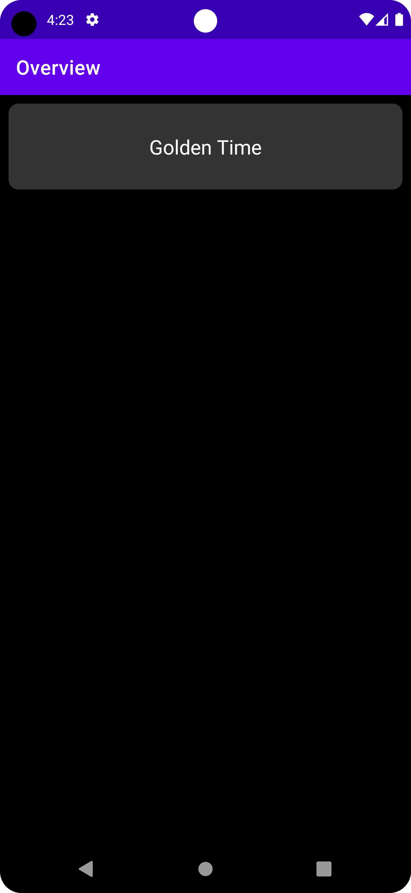
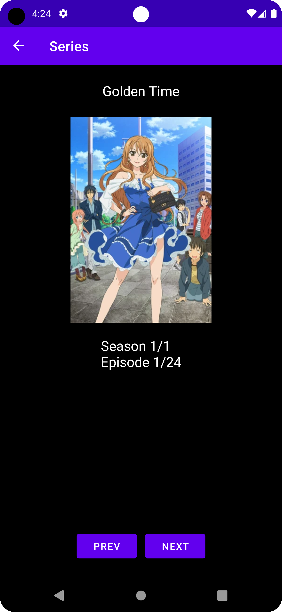

# Watcher app
This app was created in addition of the initial [Watcher Desktop App](https://github.com/vizualjack/watcher).
Because the app itself can not add new shows yet you have to get the data.json file to your phone before using the app for example with nextcloud.

 

## Features
- Set show progress to next / previous episode
- Remove existing/watching shows

## Setup
### 1. Download the app(.apk)
Please take a look at the release tab here in the repository.
### 2. Install the app(.apk)
You have to allow installing apps from unknown sources via settings.
### 3. Use it!

# Development information
This project was created with android studio so for a struggle-less start you also should use it!